# The ROM is still the game

<p class="subtitle">Rendering a 1992 Mega Drive game in three.js, with the original ROM still running as the simulation.</p>

## What this is

Landstalker came out on the Mega Drive in 1992. It is an isometric action RPG, Zelda-ish, and famous among the people who played it for having the worst jumping in the genre. The camera is a fixed three-quarter projection with no shadows and no parallax, so when you are mid-jump over a pit you have no idea where you are or where you will land. I played it as a kid, I replayed it on emulators over the years, and I never stopped resenting that one thing.

Over four days at the start of August I built a remaster of it.

<figure class="wide">
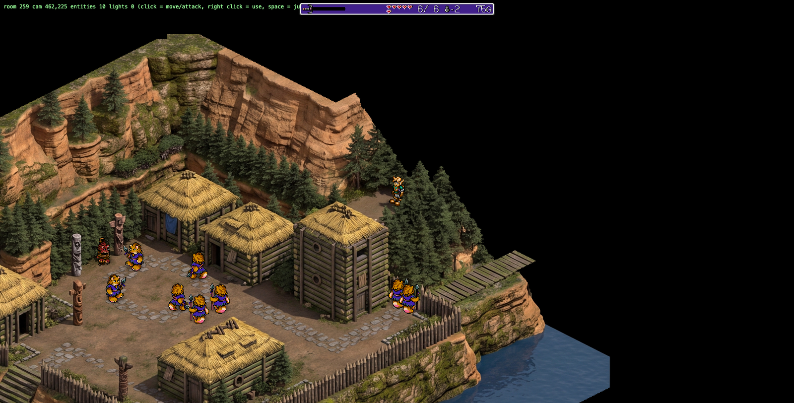
<figcaption>Gumi village. Geometry, lighting and shadows are the renderer; the world, the physics and everything you can interact with are the 1992 ROM.</figcaption>
</figure>*Gumi village. Geometry, lighting and shadows are the renderer; the world, the physics and everything you can interact with are the 1992 ROM.*

<figure class="wide">
<video controls muted loop playsinline preload="metadata" src="media/demo-hd-walkthrough.mp4"></video>
<figcaption>Walking around, running at 60Hz off the emulator's RAM.</figcaption>
</figure>

Nothing in it is reimplemented. The original ROM runs unmodified in Genesis Plus GX at 60Hz, and combat, dialogue, physics, item handling, puzzle state and room transitions still happen in the 68000 code. What I replaced is the presentation layer: a bridge reads the emulator's work RAM every frame and streams the game state over a websocket, and a three.js renderer draws that state as real geometry, using tile and sprite art extracted from the ROM. The emulator's own video output gets thrown away. It is in there as a physics and logic server. Audio passes straight through, because there was no reason to touch it.

There is one rule that kept the whole thing tractable: never write to emulator RAM. Input goes in through the pad, the same three buttons and d-pad the hardware has, and state only comes out. I was strict about this for two reasons:

1. The moment you poke memory, you have forked the game. Its bugs are now your bugs, and every "just this once" after that is more unbounded work.
2. The read-only constraint is checkable. There is a test, `test_ram_is_never_written`, that snapshots the entity table, calls the state reader twice, and asserts nothing moved. It is a slightly silly test and I would write it again, because this rule is the only thing standing between the project and a slow reimplementation of Landstalker.

So even the click-to-move pathfinding plays by pad: it plans a route over the extracted collision grid and then presses direction buttons cell by cell, like a very patient person with a controller.

Once the world is actual geometry instead of a painted picture, a lot of things that were impossible on the hardware come nearly for free. Point lights from the torches that cast real shadows. Ambient occlusion. Arbitrary zoom. A browser as the display with a phone as the controller. And a soft shadow under the player that shrinks as he rises. I did not fix the jumping (the physics lives in the ROM and stays there), but you can now see where you will land, which after thirty-four years is what I wanted in the first place.

About the ROM: "ship code, never content" is the line in the project spec. The ROM is not in the repo and is not distributed; it is a read-only input supplied by whoever runs this, pinned by SHA-1, with a hard fail on any mismatch.

One more thing before the technical part, so nobody has to wonder: this was built with coding agents. I typed 62 messages total across the four days. There is a section about that at the end, with numbers, including the parts where it went badly. I put it at the end because the interesting observation comes from comparing the two halves of this project (the reverse engineering against the AI art), and that comparison needs the rest of the article first.

## The emulator as a physics server

The bridge is a Python process holding the Genesis Plus GX libretro core through ctypes. It runs a frame, reads memory, sends messages, then sleeps until the next 60Hz tick. The whole protocol fits in a docstring:

```
server -> client: {"t": "hello", "audio_rate": 44100}   once on connect
server -> client: {"t": "state", ...gamestate}          every frame
server -> client: {"t": "video", "png": ..., "hud_mask": ...}  every 4th frame
client -> server: {"t": "input", "buttons": ["up", "c"]}
Binary frames are reserved for audio.
```

<figure class="wide">
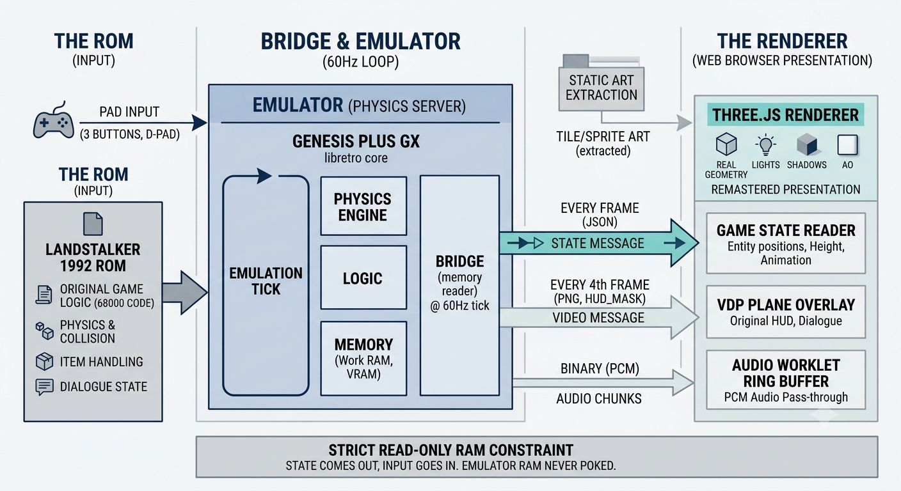
<figcaption>The shape of it. Input goes in through the pad and state comes out through the memory reader, and nothing ever goes the other way. The emulator's own video output is used only for the HUD and the dialogue boxes; everything you play is drawn from the state message.</figcaption>
</figure>

The state message is the important one. Every tick it does one bulk read of the entity table at `0xFF5400`, sixteen slots of `0x80` bytes each, slot 0 being the player. The table walk uses two sentinels the game itself uses: a first byte of `0x7F` marks an empty slot, and anything `>= 0x80` ends the table. Per entity it pulls position, height, facing, hflip, palette line, graphics id, animation and frame, type and hp. Alongside that go the camera words at `0xFF1200` and `0xFF1202`, the room id, the live colour RAM, and the VDP window-plane registers together with their RAM shadows. That is everything the renderer knows about the game.

The video message arrives at 15fps and exists only so the browser can composite the HUD, dialogue boxes and menus. Those are drawn by the VDP's window plane and would be tedious to reproduce, so I did not reproduce them. Everything you actually play is rendered from the state message.

Audio was almost free, and this surprised me. The core had been generating the full soundtrack the entire time; the driver was just dropping it on the floor because nobody had implemented the libretro audio callbacks. Implementing them got the PCM out, and it now goes over the same websocket as binary frames, batched every two emulated frames into roughly 23ms chunks, into an AudioWorklet ring buffer in the browser.

Two parts of the bridge cost me real time, and I want to describe both, because neither presented as an error.

The first is that Genesis Plus GX stores 68000 work RAM byte-swapped within 16-bit words on little-endian hosts. Every read has to be `[addr ^ 1]`. Fine, once you know it. But VDP registers are *not* swapped. And colour RAM is swapped *and also* packed differently from what the hardware documentation describes: 9-bit `BBBGGGRRR` rather than VDP colour words. None of this is written down anywhere obvious. The way it presents is that your numbers are nonsense: an entity X coordinate that jumps by 256 when the player takes one step, colours that are almost but not quite right. You stare at plausible-looking garbage and you have no idea which layer is lying to you.

The second was a hang. Mid-afternoon on the fourth day the bridge stopped sending states, while still accepting new connections and answering the handshake, which is the worst kind of failure because every quick check tells you the server is fine. The cause turned out to be a websocket send with no timeout. Vite's dev-server proxy holds a connection open after its page navigates away; that socket never drains; its buffer fills; and one `await ws.send()` blocks the entire 60Hz loop forever. The fix is one line and the comment above it is longer than the code:

```
# A half-open socket (e.g. the vite proxy after its page navigated
# away) never drains: an unbounded send blocks the 60Hz loop forever
# (observed 2026-08-06, bridge hung within minutes). Time out fast
# and drop the client.
await asyncio.wait_for(ws.send(m), timeout=1.0)
```

## Getting the world out of the ROM

The state reader only helps if the room around those entities can also be reconstructed. Landstalker stores its rooms as a heightmap: every cell carries a floor height, a set of collision flags, and a floor type. The game needs this because it is doing real 3D collision internally, on a 68000, in 1992. So the geometry I need is already in the cartridge, and the job is to decode it.

Getting to it goes through four formats stacked on each other, and I will describe them in some detail because the details are where the difficulty lives.

At the bottom is an LZ77 variant that is not deflate and not the Nintendo one. No header, no size field. A command byte carries eight flags, MSB first; a set flag means "copy one literal byte", a clear flag means a two-byte back-reference where the first byte holds the offset's high nibble in its top half and an inverse length code in its bottom half, so `length = 18 - (b1 & 0x0F)`. An offset of zero terminates the stream, and the length nibble on that final pair is meaningless. Copies can overlap, deliberately, so the copy loop has to run one byte at a time.

On top of that sit blocksets. A block is 2x2 VDP tiles, and the compressed form interleaves three separate concerns. First come three run-length-coded bitmasks over every tile, one each for priority, vertical flip and horizontal flip. Then the tile indices, through a 16-entry move-to-front queue where one bit chooses between a 4-bit queue index and an 11-bit literal that gets pushed. Then, because tiles usually come in mirrored pairs, tiles are decoded two at a time: after the first, a single bit says "the second is the first plus or minus one", and which of plus or minus depends on the horizontal flip attribute that was decoded back in the first mask pass. That is a cross-pass dependency inside a bitstream. If you get the sign backwards, the output still looks like a tilemap.

Room maps are two independent bitstreams in one blob. The layer section builds itself from a 14-entry offset dictionary whose first six entries are computed from the room's width rather than read; it uses a three-bit command that takes two further bits to reach values six through thirteen; and it has a vertical propagation mode that alternates straight-down and diagonal runs. The heightmap section is separate, run-length coded over 16-bit cell patterns, with 8-bit counts that chain when they hit `0xFF`.

Sprites are a four-level pointer chase (a base pointer, an animation table of 403 entries, a frame pointer table of 1268 entries resolving to 834 unique blobs) with no count fields anywhere, so animation ranges have to be recovered by differencing consecutive pointers. Inside a frame, the tile data has LZ77 nested within its own command-word stream, and tiles within a subsprite are stored column-major. Two of the lookup tables are not reachable through any pointer table at all: they are addressed by 68000 `lea d16(pc)` instructions, so the extractor decodes two instructions out of the code segment and takes the sign-extended displacements.

I did not work any of this out from raw bytes, and I want to be clear about that. Landstalker has been reverse engineered for years by people who were very good at it. There is a full disassembly that reassembles byte-identical, a C++ format library, an editor, and two randomizers. One randomizer reads live RAM from a running US ROM, so it corroborates memory addresses rather than cartridge ones. All five got vendored into a `refs/` directory and treated as the specification.

What none of them had done was connect any of that to a renderer. The data side of Landstalker has been solved for years by people doing careful, unglamorous work. The drawing side had not been attempted.

The project spec I started from deliberately contained zero addresses. It had a note attached: any offsets it supplied from memory would be unreliable, so derive every one from those sources or from live investigation, and write each into `docs/offsets.md` with a note on how it was confirmed. That file has a provenance column. Entries never confirmed against a live emulator are still marked unverified. One of the format docs says outright that two flag bits are disputed between two reference implementations and that I do not know which is right. I prefer to write down what I don't know than to pretend the table is finished.

## How you know it's right

A subtly wrong decompressor does not crash. It produces plausible-looking garbage, and then you build a renderer on top of it and spend a week wondering why one room in twenty has a corrupt corner. I have abandoned enough hobby projects at exactly that point to know the shape of it. So before building the renderer, I built three oracles.

For LZ77 there is a command-line tool in one of the reference repos, so the test shells out to it for every compressed sample in the disassembly and asserts byte equality. That is 64 blocks: fonts, tilesets, title screen, HUD, inventory, the lithograph, the ending.

For room maps and blocksets, the reference C++ library is the oracle, but not through its shipped CLI. That CLI round-trips through CSV and never tells you how many compressed bytes it consumed. The consumed size is the single most bug-prone return value in a bitstream decoder, because every off-by-one in your bit accounting shows up there first and nowhere else. So there is a 65-line C++ program in `test/oracle/` that links the library directly and dumps values line by line: header fields, then one line per cell. The Python decoder has to match every field, every foreground cell, every background cell, every heightmap cell, and the compressed size, across 643 room maps and 115 blocksets.

For the ROM tables, where no library helps, the disassembly's own packed binary assets are ground truth. Some tests are direct byte-slice equality, which proves an offset constant is right. Others hash the decoded structure and require it to be a member of the set of hashes from the disassembly's files, which proves the pointer-table walk finds the right blobs even though rooms share maps. That path caught a real trap: the sprite frame files carry a trailing pad byte when a frame has odd length, because frames must start on even 68000 addresses, and without an explicit allowance for it you get two hundred spurious mismatches.

Altogether 856 tests, running in 4.7 seconds. The suite also boots the actual emulator, drives it to gameplay from a cached savestate, and asserts that the frame counter advances by exactly ten when you run ten frames.

On top of the tests there is a pixel harness. It compares the emulator's own framebuffer against a pure-Python render of the same room from extracted assets, and reports a percentage. Getting that number to mean anything took more care than the comparison itself: it waits for the palette fade to finish and the camera words to stop moving before capturing, it renders colours through the emulator's exact RGB565 expansion rather than a naive ramp, and it masks out sprite pixels by walking the VDP sprite attribute table's link list, since entities are not part of a static room render. The number came out at 98.1% average background match across the reachable rooms, worst room 97.0%. The residual is animated tile phase, plus a couple of places where the game edits its own tilemap at runtime. There is a rope bridge in the prologue that physically collapses, so the live tilemap legitimately differs from the cartridge there.

The best bug the harness caught was in the harness itself, and I want to tell this one properly. The match percentage sat stubbornly low, several points below where it should have been, and it would not move. I went back through the decoders. They were fine. I went through the palette expansion. Fine. Eventually I looked at *where* the mismatching pixels actually were, and they were all at the top and bottom of the frame. The game only draws the scrolling map in screen rows 21 through 184. Above that is the HUD; below it is blank. The comparison had been counting both regions as extraction errors. The extracted geometry had been correct the whole time, and I had spent the debugging session auditing innocent code. I find this a strong argument for building harnesses even when they are miscalibrated: a wrong number is something you can investigate. No number, and I would simply never have looked.

<figure>
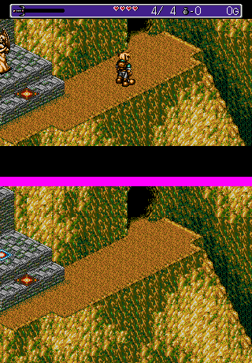
<figcaption>The pixel harness. Top is the emulator's own framebuffer, bottom is the room rendered from extracted assets. The magenta band is the region under test.</figcaption>
</figure>*The pixel harness. Top is the emulator's own framebuffer, bottom is the room rendered from extracted assets. The magenta band is the region under test.*

The animated tileset table shows where this approach runs out. It has a length field, and I read it as bytes. It is VDP words, so every animation frame was half the size it should be. No oracle covered that table, so nothing failed, and the bug sat there until reading the game's own DMA routine and watching live VRAM exposed it. Wherever ground truth runs out, this is what the work goes back to looking like.

## Drawing it

With the room data checked, the projection comes straight out of the disassembly, from a routine that converts world coordinates to screen coordinates every frame:

```
dx = CentreX - Z - camX
dy = CentreY - Z - camY
screen_x = dx - dy + 0x120
screen_y = ((dx + dy + parity) >> 1) + 0xE8
```

Two consequences fall out of this. Z cancels from the horizontal axis entirely, contributing only to screen_y, which is exactly why the game is unreadable in the air. And the camera words are not a camera position at all; they are the player's own flattened coordinates, tracked incrementally as he moves. The player is always drawn at screen (160, 104) and everything else moves around him.

Written continuously, the map is `screen_x = 16(x - y)` and `screen_y = 8(x + y) - 16z`. The view axis, the direction that projects to a single point, is exactly (1, 1, 1). Depth is therefore just `x + y + z`.

The renderer uses that identity directly. Geometry is built in screen space, with `x + y + z` written into the z coordinate, and viewed through a plain orthographic camera. There are no rotation matrices and no camera rig. It is exact by construction, and several later features reuse the same identity.

Textures are palette indices, not colours. Each room rasterises into a two-channel texture holding a 0-15 palette index and an emissive flag per pixel, and the fragment shader resolves the index against a 16-entry palette texture that gets re-uploaded from live colour RAM every frame. Fades, menu dimming, damage flashes and room transitions stay frame-accurate because they are palette animations in the original, and they remain palette animations here.

Matching the emulator's colours exactly needed one more piece of trivia: Genesis Plus GX in its normal mode doubles each 3-bit channel and then packs to RGB565, and the maximum channel value that comes out the other side is 238, not 255. Every colour in the game is slightly darker than a naive expansion gives you. Get this wrong and every pixel in the room mismatches by a little, and the harness cannot tell you whether your decoders are broken or just your palette.

The renderer runs in linear light with a float palette, and the only pixels allowed to exceed 1.0 are emissive ones, so a bloom pass thresholded at exactly 1 picks up torch flames and nothing else.

The original draws 320x224 because that is what the hardware had. The 3D view has no VRAM limit, so the viewport fits the original playfield and shows more of the room around it when the browser window is bigger.

## The sprite problem

The spec warned me about this before a line of it existed: priority bits and sort order will fight you, budget real time, this is the main source of visual wrongness. It was right, and it still took three attempts. I will go through all three, because the sequence is the story of me slowly noticing I had the wrong mental model.

Sprites are billboards, flat quads standing in the world. The first version put each quad at its entity's depth, and walls behind the character clipped his head off, because a wall face one cell further back has greater depth than the character's feet. Obvious enough in hindsight.

Second attempt: lean the top edge of each quad toward the camera by the sprite's own height. This fixed the general case. Then characters pressed flush against a wall still lost a few pixels, so the quad got a half-cell depth bias, on the reasoning that a sprite represents the front half of a person. Better. Still wrong near the huts in the first village, and still wrong mid-jump. At this point I was tuning constants and each fix was making a different room worse, which is usually the sign that the premise is broken.

The premise was broken. The VDP does not depth-test sprites against background graphics. There is no depth buffer on a Mega Drive at all. Sprites and planes are separate layers composited by fixed rules, and the only mechanism by which background art can cover a sprite is a single priority bit. Landstalker computes that bit itself, every frame, per entity: a routine checks whether terrain in front of the entity is taller than it is, and if so clears the bit so the entity draws behind the foreground art. It caches the result in a per-entity structure, and the bridge reads it out and ships it as a boolean. (The bit reads 0 in the trench room's ditches and 1 on open floor, which is how I confirmed I was reading the right byte.)

So the third version stopped trying to be clever and reproduced the hardware. Room geometry draws into a full depth buffer. Then the depth buffer is cleared. Then a second scene draws the sprites plus one extra pass of the room geometry containing only its priority-bit pixels, sequenced by render order: demoted sprites first (writing depth), then the priority art on top of them (ignoring depth), then normal sprites (depth-testing, so they only lose to a closer demoted sprite, which is the one case where the hardware keeps the plane art in front).

That removed the clipping, and it removed it categorically: room geometry can no longer shave a sprite under any circumstances, because on the console it never could. The artists drew those rooms knowing that, and placed roofs and ledges and eaves to take advantage of it. My earlier attempts were fighting their art direction with a depth buffer.

<figure class="wide">
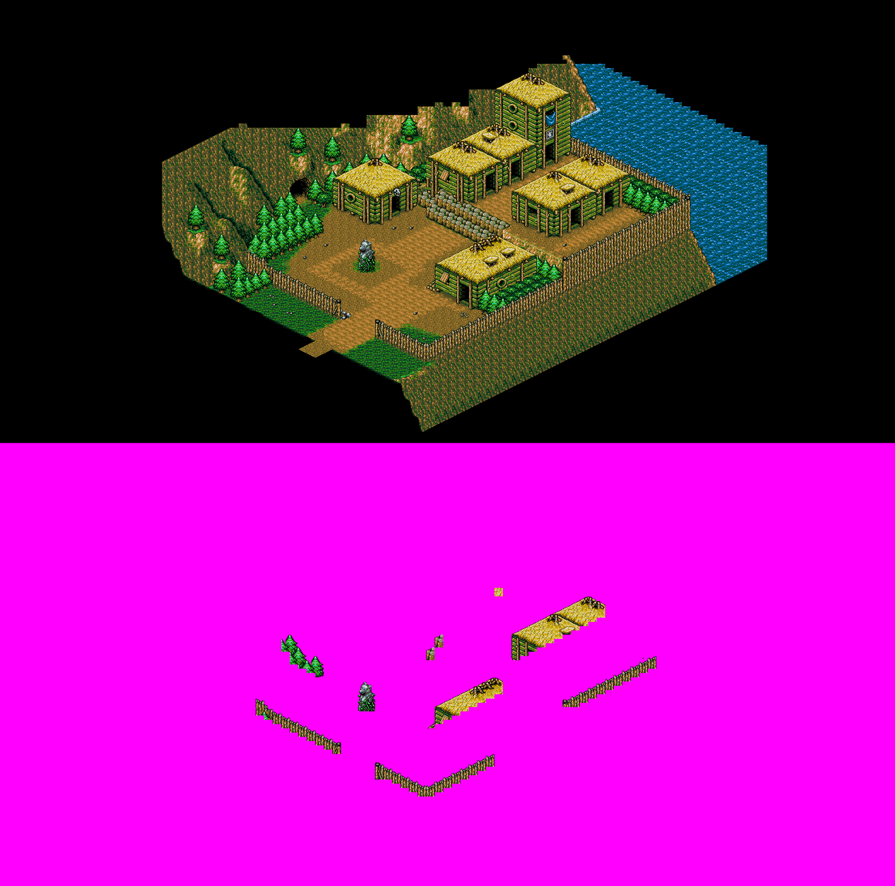
<figcaption>Massan, the room where the clipping was worst. Roof and step faces used to shave pixels off the character; now only the game's own priority bit can put art in front of him.</figcaption>
</figure>*Massan, the room where the clipping was worst. Roof and step faces used to shave pixels off the character; now only the game's own priority bit can put art in front of him.*

Every visual change in this project has to keep an exact-mode render pixel-identical to the Python renderer, and this rework did.

## What you get for free once the world is 3D

Torch lights were the first thing that felt like cheating. Hand-placing lights across 816 rooms was obviously not happening, and it turned out I did not have to: flames in this game are animated tiles, and a warm-coloured animated tile is in practice always fire, since the other animated tiles are cool-coloured. So the renderer scans a room's block layers, picks out animated tiles whose average colour is strongly red-dominant, clusters adjacent cells, and emits one point light per cluster. Nothing hand-authored, and it covers every room in the game.

My favourite three lines in the codebase handle flames painted on walls. A flame like that is at the wall's position, but a light source there sits inside the geometry. Because the view axis is (1, 1, 1), every point along that axis projects to the same screen pixel, so the light just slides along the view axis until it finds passable floor, and ends up hovering in front of the wall while its projection stays exactly on the painted flame.

<figure>
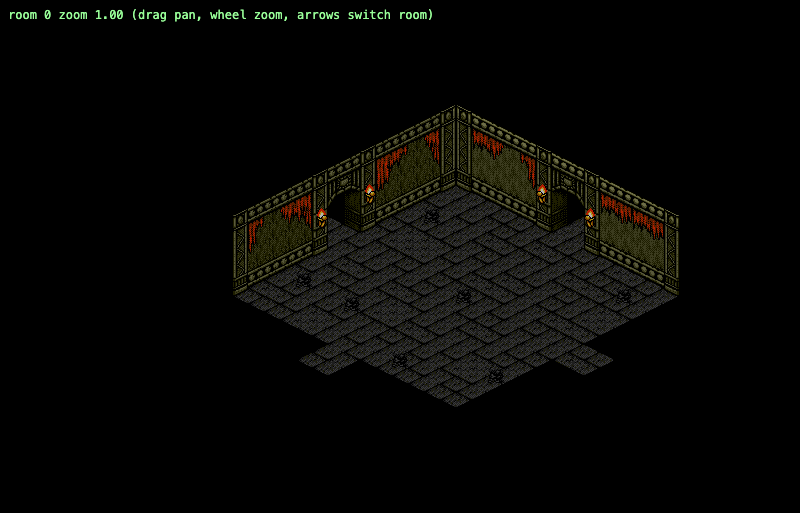
<figcaption>First attempt at torch lights.</figcaption>
</figure>*First attempt at torch lights.*

<figure>
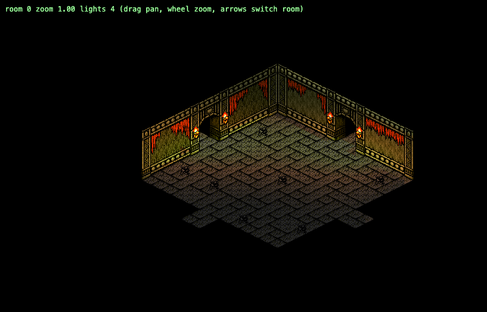
<figcaption>After clustering, flicker and emissive bloom. Nothing here is hand-placed; the room was scanned for warm animated tiles.</figcaption>
</figure>*After clustering, flicker and emissive bloom. Nothing here is hand-placed; the room was scanned for warm animated tiles.*

Cast shadows work off the heightmap. At room load, every visible face gets sample points marched toward the sun over the heightmap grid; a blocked ray means that sample is in shadow. The results rasterise into a half-resolution screen-space mask, resolving overlaps with the same `x + y + z` depth rule, get one box blur for a soft edge, and are sampled in the fragment shader. This takes 15 to 17 milliseconds per room and is cached, so it happens inside the game's own fade-to-black on room entry and nobody ever sees it happen.

<figure class="wide">
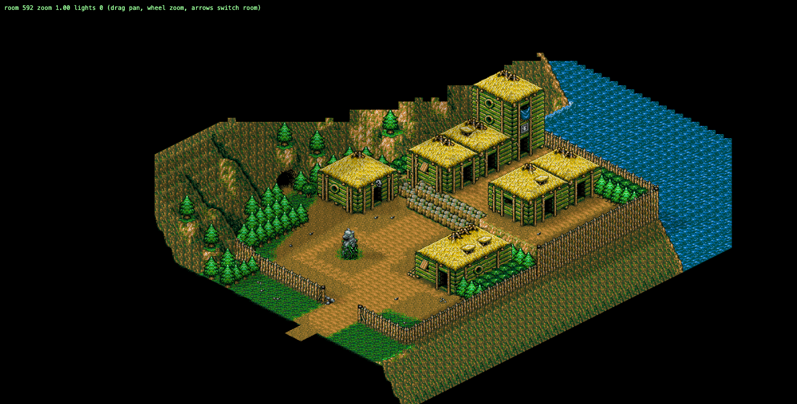
<figcaption>Directional sun with baked shadows off the heightmap.</figcaption>
</figure>*Directional sun with baked shadows off the heightmap.*

And the blob shadows, which are the reason I started all of this. Ground height comes from the extracted heightmap, and the shadow is a world-space circle laid on the floor, which the projection turns into a correctly proportioned ellipse without any extra work. It shrinks and fades as the character rises. That is the whole feature. The jump arcs are identical to 1992, but you can see where you will land now.

I spent that entire ideation conversation trying to work out how to fix the physics, and fixing the physics was never what I wanted. I wanted to see where I was going to land. Those are not the same requirement, and the cheap architecture only became available once I had said the second one out loud.

<figure class="wide">
<video controls muted loop playsinline preload="metadata" src="media/demo-pathfinding-zoom.mp4"></video>
<figcaption>Click-to-move pathfinding and free zoom. Every move is still pad input into the emulator.</figcaption>
</figure>

Every one of these features defaults to off, and with the neutral settings the shader arithmetic reduces to multiplying by one and adding zero. Exact mode forces the features off entirely, so the pixel harness cannot drift while I am making things pretty. This is the only reason I still trust the 98.1% after four days of visual changes. Note what it protects, though: the extracted renderer. It says nothing about whether a generated backdrop still depicts the same room. Which brings me to the half of the project where nothing could be asserted.

## The other half: the art, and the gate that could not see

The generated art had no oracle, and could not have one, and this section is about what that turned out to mean in practice.

One admission first. The ideation conversation never discussed generating art at all. The only trace of it is a passing exchange about giving NPCs more variety, where the answer pointed out that outside the ROM there are no VRAM or palette limits, and that the hard part would be stylistic consistency: new art has to match the original's conventions or it reads as foreign against the extracted world. That is the whole second half of this project, described in one sentence, on day zero, by someone who had not seen any of it. I filed it under later.

The pipeline rasterises a room canvas from the extracted assets, pads it with black to the nearest aspect ratio the image API supports, and sends it image-to-image to Gemini at 4K with a prompt insisting the layout is authoritative. It resizes the result back to exactly 4x, crops the padding, and forces the void area black again. Room variants share art, so deduplicating by rendered identity turns 816 rooms into 647 unique canvases. The renderer then swaps the palette-index albedo for the generated image and keeps every other feature: lighting, shadows, ambient occlusion, the priority overlay, and the colour-RAM fade tracking, so HD rooms still fade correctly through doors.

It works, and to my eye the result looks better than I expected. I went through six style candidates before settling on a Vanillaware-ish painted register.

<figure class="wide">
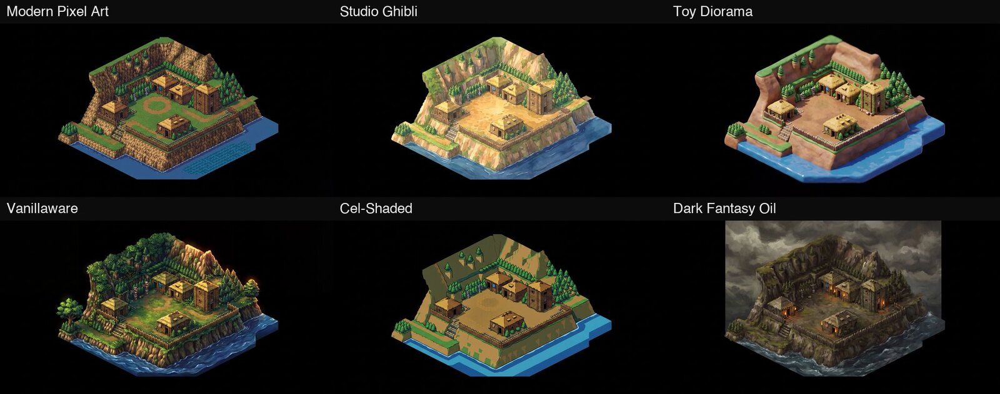
<figcaption>Six candidate styles, same room, same geometry. Vanillaware (bottom left) won.</figcaption>
</figure>*Six candidate styles, same room, same geometry. Vanillaware (bottom left) won.*

<figure class="wide">
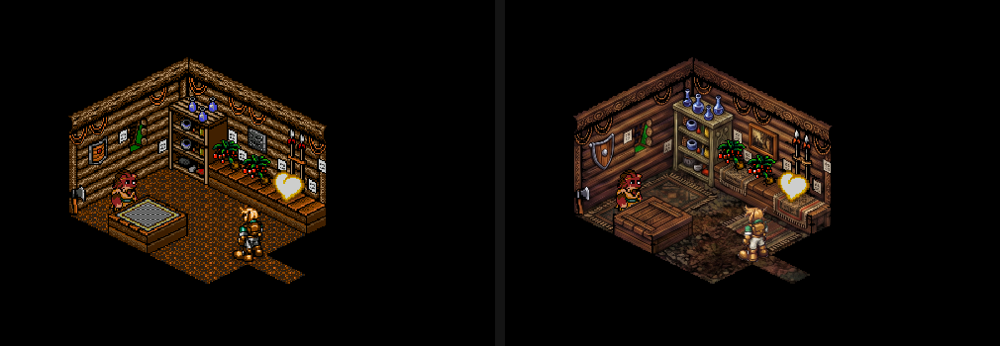
<figcaption>The L key, mid-session. Same frame, same geometry, different albedo.</figcaption>
</figure>*The L key, mid-session. Same frame, same geometry, different albedo.*

<figure class="wide">
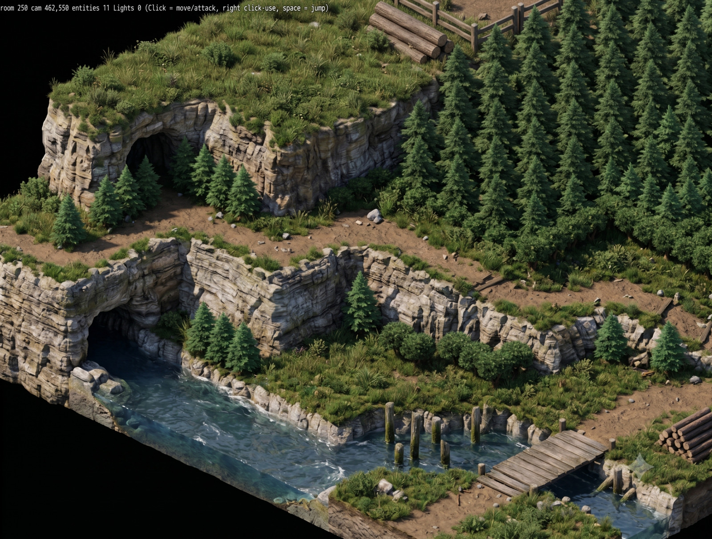
<figcaption>The register I did not take. Photoreal renders of the same rooms look genuinely good and belong to a different game.</figcaption>
</figure>*The register I did not take. Photoreal renders of the same rooms look genuinely good and belong to a different game.*

<figure class="wide">
<video controls muted loop playsinline preload="metadata" src="media/demo-realistic-style.mp4"></video>
<figcaption>The same thing in motion, which is where it stops working.</figcaption>
</figure>

Quality control started with alignment, which is at least measurable. Take the generation, downscale it back to source resolution, run a Sobel filter on both, take the top decile of gradient magnitude as "strong edges", and measure the median distance from each source strong edge to the nearest generated strong edge. Require it under four pixels. Also FFT phase-correlate the two gradient fields and require a global shift of exactly zero. Three attempts, then mark the canvas rejected and fall back to pixel art. This gate catches the model reframing or rescaling the image, which it does surprisingly often; two canvases have never passed it in any style because the model insists on shifting them.

<figure class="wide">
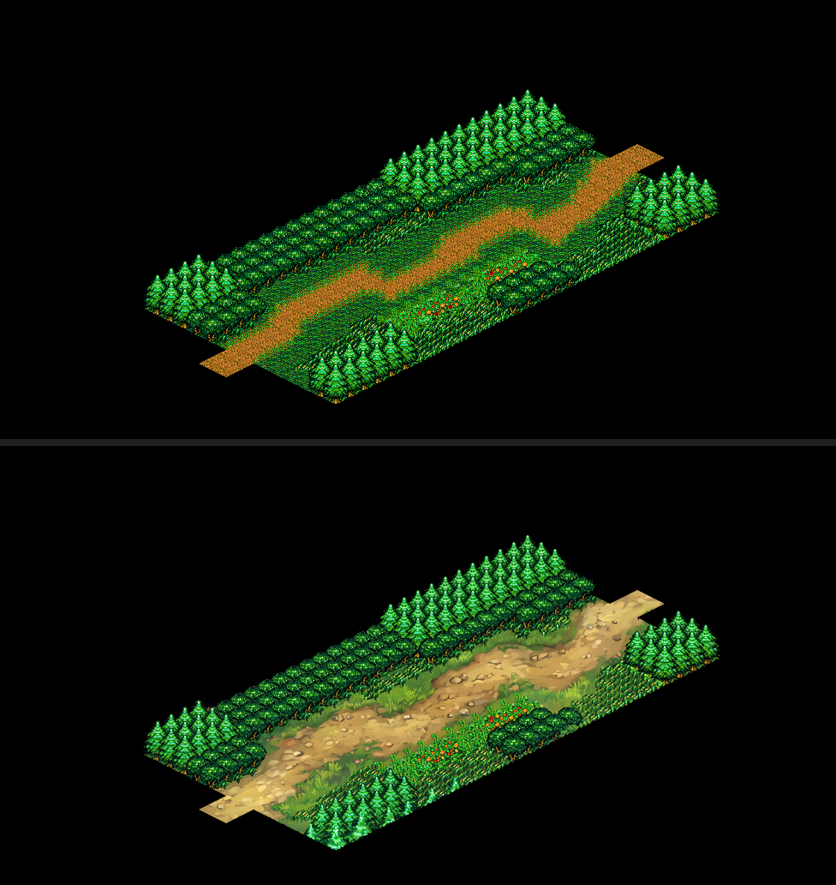
<figcaption>What a good one looks like. Source render on top, generation below, same silhouette and the same walkable path.</figcaption>
</figure>*What a good one looks like. Source render on top, generation below, same silhouette and the same walkable path.*

Then I walked into the church interior, which had passed the gate cleanly, and it was badly wrong. The model had read a small indoor room as an outdoor plaza. The walls had become floor. The statue and altar were gone. And the gate did not care, because edges staying put is exactly what a content inversion with intact layout looks like.

Four more turned up the same way. A route canvas where the vertical cliff face became a top-down forest floor, so the walkable path ran across what now read as treetops, the waterfall collapsed into a puddle, and a ladder had been invented against a doorway that had none. Another where the model painted a river along the walkable dirt path, narrowing it and replacing half of it with water the player walks straight through. That one scored a median edge distance of 1.0 pixels and zero global shift. A perfect alignment report, for a canvas with a river through the middle of the road.

<figure class="wide"><div class="triptych">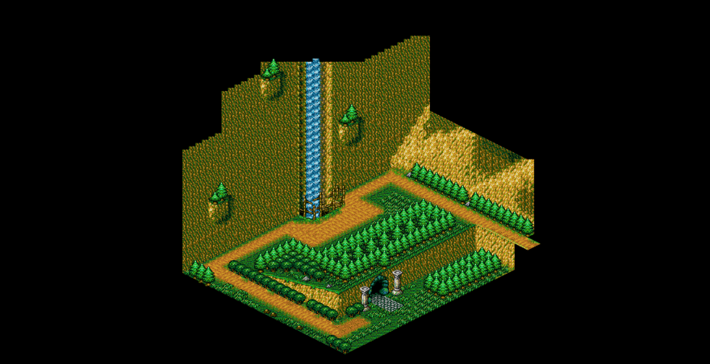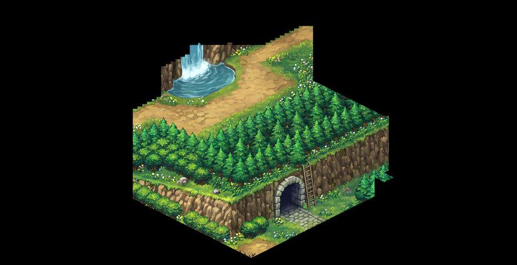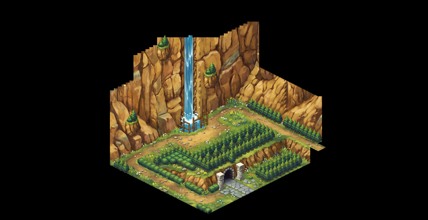</div><figcaption>Left: the source render. Middle: a generation that passed the alignment gate. The vertical cliff has become a top-down forest floor, the waterfall has collapsed into a puddle, and a ladder has been invented against the doorway. Right: the same canvas after the prompt and the gate were fixed.</figcaption></figure>*Left: the source render. Middle: a generation that passed the alignment gate. The vertical cliff has become a top-down forest floor, the waterfall has collapsed into a puddle, and a ladder has been invented against the doorway. Right: the same canvas after the prompt and the gate were fixed.*

So: five semantically broken canvases, zero caught by the automated gate. All five were caught by a human looking at pictures, two by me noticing something looked off while playing, the rest in a manual pass over the batch.

I built a second gate that tries to see meaning, and I will describe it even though the conclusion is going to be that it doesn't work well enough, because the ways it fails are instructive. For every cell in the game's own heightmap, project its top face into the canvas using the same projection the renderer uses, and sample a patch in both the source render and the generation. Blur each patch into an opponent-colour vector (luminance, red minus green, blue minus yellow) so brushwork averages out and only the material-level colour survives. Cells whose source colours match each other, anywhere in the room, are the same material, so their generated colours should also match each other. The statistic is each cell's deviation from the median of its own reference group, which distinguishes small scattered deviations from the large, spatially connected, directionally coherent blobs left by semantic inversion. Reject if more than a quarter of sampled cells are anomalous. Plus a second, embarrassingly specific rule for invented water: eight or more connected anomalous cells, drifting in a consistent direction, blue-shifted, not darkened (to separate a painted river from a painted shadow), and smoother than their reference cells, because water is flat and foliage is busy.

All three broken canvases I had kept as backups now reject. Forty-five of the forty-six previously accepted canvases pass, and the one that flags was independently known to be degraded. So far so good.

It still cannot see. Room 181 scored an anomaly fraction of 0.0, no coherent component at all, a median edge distance of 1.0 pixels (a flawless report on every axis I measure), and the statue in that room had been repainted as a living person. A pit in a floor got painted as a pool of water; the gate rejected two attempts and accepted the third, because the pool was dark and my "not darkened" condition let it through. Conifer trees appeared inside a cave, and the water detector was structurally incapable of firing because the colour drift went the wrong way on every one of its axes. And the two canvases that never pass the alignment gate sample one cell and twenty cells respectively, both below the thirty-cell minimum where the structural gate declares itself inconclusive and passes by default. On the rooms most likely to fail, the gate never runs at all.

The prompt is an archaeological record of the same process. It started at six clauses and grew one per disaster. Merging trees produced a clause about keeping their exact count and species. The church produced another that spells out which part of an isometric interior is wall and which is floor. Water must stay saturated blue. Clause eight reads in part "A flat wall decoration in the source stays a flat wall decoration; never reinterpret one as a ladder or any other three-dimensional object", after a test generation turned a wall banner into a ladder.

Character sprites presented the same problem in a different shape. All of a character's frames go into one grid and get regenerated in a single call, because that is what holds identity constant across poses. Alpha authority never leaves the original: the source silhouette, dilated two pixels, caps what can be opaque, so a generated sprite physically cannot leak outside an honest outline. I measured identity drift between adjacent walk frames and got a worst-case channel shift of 6 out of 255, which is excellent, and I was briefly pleased with myself. Then I watched them in motion. They shimmer. Hair tufts change shape, the scabbard drifts a few degrees, the dog's harness wobbles, and at 60Hz it reads as a faint boil. The metric measured colour consistency, which held up, and said nothing about shape consistency, which failed.

<figure class="wide">
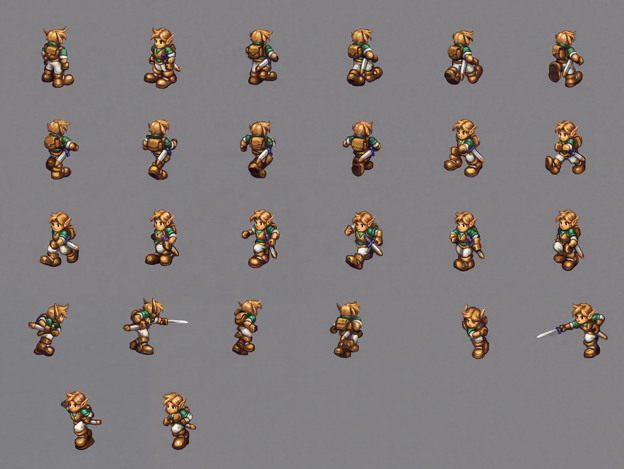
<figcaption>One character, every frame, one generation. Sending them as a single sheet is what keeps the character the same person across poses.</figcaption>
</figure>*One character, every frame, one generation. Sending them as a single sheet is what keeps the character the same person across poses.*

<figure class="wide"><div class="triptych">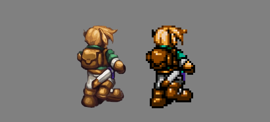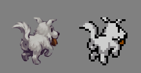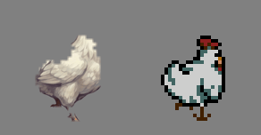</div><figcaption>Sliced back into animations. The boil is easier to see than to describe.</figcaption></figure>*Sliced back into animations. The boil is easier to see than to describe.*

My honest conclusion after three generations of art packs: the gate will never be sound, because the question is semantic and the measurement is not. The eyeball pass is the real gate, and the right engineering move is to make the eyeball pass cheap: one contact sheet, source beside generation, all forty-eight canvases in the current pack, one scroll. I should have built that first, instead of the two gates. I built the metrics because building metrics was more fun, and I am writing that down so that at least next time I will know I knew.

## How this actually got built

The build took four days, three substantive sessions, roughly twenty background subagents, and 62 messages typed by me. The first one was 172 characters:

> read ~/Downloads/landstalker-3d-spec.md - find the ROM in the same folder, do more research as you see fit, then let's start implementing this. if you need to amcq, do that

Twenty-six minutes later the agent had pinned a ROM revision by SHA-1 and asked whether I wanted a different dump. My answer, in full: "commit as you wish, and US is fine if you say it is. continue". Most of the rest of the project is in that register.

I categorised all 62 messages afterwards. About a third are taste and art direction. About a quarter are bug reports from playing the thing. A sixth are some variant of "go ahead". A sixth are managing the work queue: which subagent does what, in what order, what to parallelise. Roughly one is architectural.

The flattering way to read that distribution is that I set the constraints and then stepped back. I would like to claim it. The transcripts do not really support it, and it is worth being precise about what I actually contributed, because I think the honest version is more interesting than the flattering one.

The constraints came from the spec, which I had written in a separate conversation before opening an editor, and it is the load-bearing document of the whole project. It names the model (the original stays authoritative, replace only presentation) and it lists non-goals in imperative form, each with a one-line reason. Do not reimplement game logic. Do not fix the jumping. Do not build a free camera. Do not modify or redistribute the ROM. Above them sits a sentence I never had to repeat: "Each one converts a bounded project into an unbounded one."

Those non-goals were not decreed. They are what was left after an hour of pricing the alternatives. The conversation ran through four of them: patch the 68000 jump and collision routines in the disassembly, extract everything into a new engine and reimplement the controller, do a full remake, or leave the ROM running and replace only what it draws. The last one, which is what got built, had been explicitly ruled out earlier in that same conversation, on the grounds that if the emulator is the physics then it can never fix the jumping. It became available again only when I gave up on fixing the jumping, at which point the thing that had disqualified it was the thing that made it cheap. That is my best explanation for why the non-goals held across 62 messages without me ever defending them. They had already been argued.

In 62 messages, I never once had to defend those non-goals during the build. Several decisions came close to the line (click-to-move pathfinding and the step-up jump assist both sit right on the boundary between presentation and gameplay), and the agent held the line itself, in the spec's own vocabulary, and wrote the reasoning into the commit messages. Two of my three session-opening prompts were handover documents that the previous session's agent had written for me, which I pasted without editing. The single most technically detailed "human" message in the entire corpus is one of those, and I did not write a word of it. On day four I described my own project back to the agent to check that I understood it, and got three corrections and two omissions in return.

What I actually contributed came almost entirely from having the game open in front of me:

> btw the sprites seem to be upside down, the stats and Nigel are, in our version

> one more thing, there is some odd clipping [...] seems to happen when nigel is against a non-room wall?

> hmm, the original vanillaware looked better, more detailed. this one looks like a flash game, sort of. any ideas why, and how we can get it more like the initial version I fell in love with?

> ok cool. btw. I noticed a small bug in the interior, the church looks broken, at least with the previous HD backdrop, something to check maybe

That last one, typed in passing, is the church from the previous section, and it is the reason the structural gate exists.

<figure class="wide">
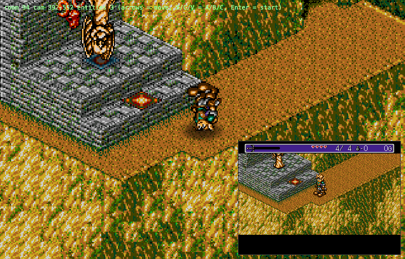
<figcaption>The first of those reports. Billboards were rendering vertically flipped, character and torch flame both. The inset bottom right is the emulator's own output, which is what it should have looked like. The camera is y-down, so the sprite texture needed its vertical flip disabled.</figcaption>
</figure>*The first of those reports. Billboards were rendering vertically flipped, character and torch flame both. The inset bottom right is the emulator's own output, which is what it should have looked like. The camera is y-down, so the sprite texture needed its vertical flip disabled.*

The mobile controls are the sharpest single illustration of the pattern. A subagent built a touch layer and verified it exhaustively, with real Chrome touch events dispatched through the debugging protocol, proving that tap and drag and flick and pinch all produced the right pad output, 850 tests green, screenshots attached. Every gesture worked. I put it on my phone, played for twenty minutes, and reported: "right now I don't even know how to swing the sword". It had shipped a gesture-only scheme with no visible buttons. The verification was complete and correct and the thing was unusable, because nothing it could check would have told it that.

The irritating part is that the right shape had already been specified. The same ideation conversation had described it before any code existed: a screen-relative stick that appears under the thumb, snapping to the world axes, with visible buttons kept out of the play area. That is roughly what the touch layer became on the second attempt. The prediction was there. What nobody predicted was that an agent would ship 850 passing tests around the wrong shape first.

<figure class="wide">
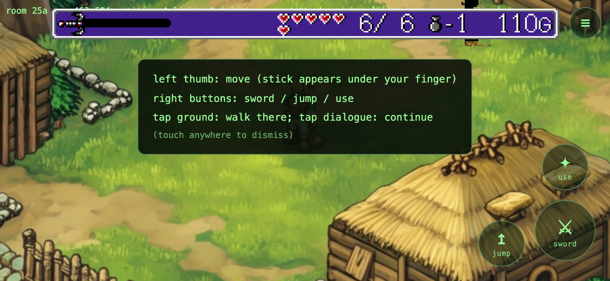
<figcaption>The replacement: a floating stick under the left thumb and actual visible buttons under the right.</figcaption>
</figure>*The replacement: a floating stick under the left thumb and actual visible buttons under the right.*

Here is the comparison I promised at the top. The two halves of this project were built in the same week, with the same tools and the same coding agent. The emulator, extractor and renderer half had cheap sound oracles at every step: a reference implementation to diff against, a byte-exact assertion, a pixel percentage, 856 tests in under five seconds. That half converged in days, ran largely unsupervised through background agents, and I honestly could not tell you what most of the commits contain. The art half has no oracle, because "is this canvas semantically faithful" is not a question you can assert on. That half needed me for every judgment, produced five semantic failures that no automated check caught, and after three generations of art packs is still not settled. Same agent, same week, same person. The only variable was whether the feedback loop could run without me.

The cheap feedback also changed which work was worth doing at all, and I think this is the underrated part. Working alone, I would never have written a C++ oracle harness for a hobby project. Nobody does. You spot-check three rooms, decide it looks fine, and pay compound interest on that decision for the rest of the project, usually around week three, when one room in twenty has a corrupt corner and you have forgotten how the decoder works. Here the thorough option cost almost nothing, so I took it, and every layer afterwards got to stand on something proven.

Which changes the honest counterfactual. Without agents this is not a four-day project; it is most of a year of evenings for someone who already knows 68000 assembly, VDP internals and three.js. More likely, it is not a project at all. Things like this die at a specific place: month two, the decoder is 95% right, one room renders garbage, there is no oracle because building the oracle felt like a detour, and the debugging plateau runs for weeks with nothing to show for it. The test suite is what makes that plateau survivable.

What is left: a WebAssembly build, which moves the core into the browser and makes the whole thing a static page instead of a server per player. And every remaining NPC sprite sheet, which I will probably not do.

The last thing I typed at this project, at six in the morning after too many parallel sessions, was "small change, make her house a rainbow themed house". Ten minutes later: "damn, wrong session, pls revert". By then the agent had already regenerated the house.

---

The code is not public yet. When it is, it goes up without the ROM and without the extracted assets, which is the only way it can go up.
